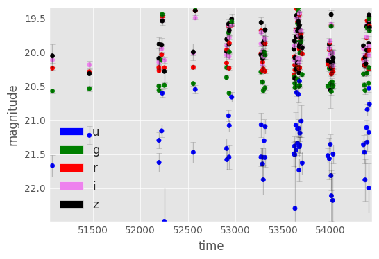
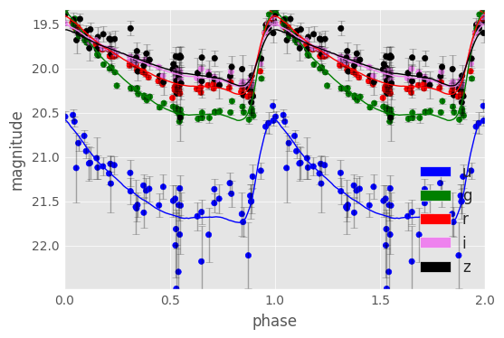
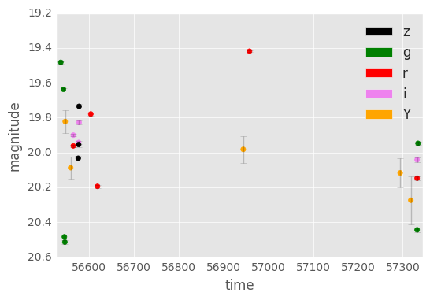
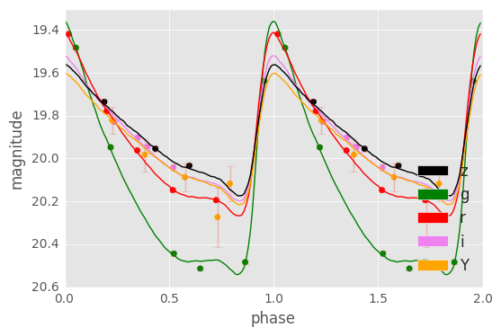

# RR Lyrae Templates

Fit templates to RR Lyrae to estimate star variability parameters. The code takes data like this:

and outputs 5 parameters (distance modulus, dust, amplitude, frequency, and phase) which can be used to construct the folded light curve:

The model is designed to work even on very sparsely sampled light curves. Fitting the model to this Dark Energy Survey RR Lyrae

we determine it has a period about 0.54 days, and distance modulus of 19.2 and folded light curve:

## Using the Software

The fitting code is written in R. This software includes demonstrations in both R and python (via `rpy2`) in the files `demo_R.ipynb` and `demo_python.ipynb`.

These templates were constructed for and used in Stringer et. al. 2018+ in prep.

The templates were constructed by James Long (jlong@stat.tamu.edu). Please contact with questions or bug reports. The code used to construct the templates (from SDSS Stripe 82 RR Lyrae) is available from Long upon request.